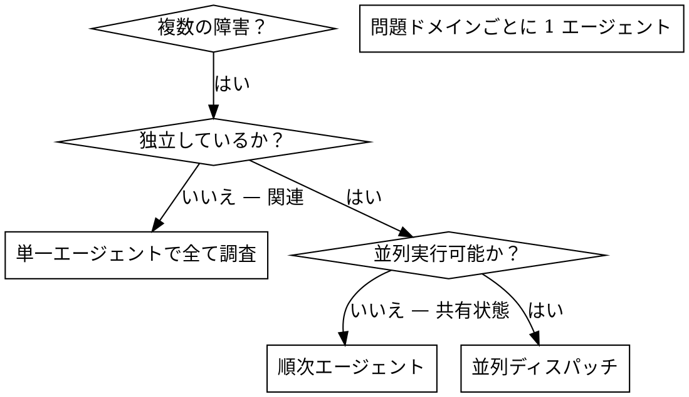

# 並列エージェントのディスパッチ

## 概要

タスクを隔離されたコンテキストを持つ専門エージェントに委譲します。指示とコンテキストを的確に構成することで、エージェントが集中してタスクを成功させるようにします。セッションのコンテキストや履歴を引き継がせず、必要なものだけを正確に構成してください。これにより、自分のコンテキストも調整作業のために温存できます。

複数の無関係な失敗（異なるテストファイル、異なるサブシステム、異なるバグ）がある場合、それらを順番に調査するのは時間の無駄です。各調査は独立しており、並列に実行できます。

**基本原則:** 独立した問題ドメインごとに 1 エージェントをディスパッチし、並行して作業させる。

## 使用するタイミング



**使用する場面:**
- 3 つ以上のテストファイルが異なる原因で失敗している
- 複数のサブシステムが独立して壊れている
- 各問題が他の問題の文脈なしに理解できる
- 調査間で共有状態がない

**使用しない場面:**
- 障害が関連している（1 つ直せば他も直る可能性がある）
- システム全体の状態を理解する必要がある
- エージェント同士が干渉し合う

## パターン

### 1. 独立したドメインの特定

障害を壊れている部分ごとにグループ化:
- ファイル A のテスト: ツール承認フロー
- ファイル B のテスト: バッチ完了の動作
- ファイル C のテスト: 中断機能

各ドメインは独立 — ツール承認の修正は中断テストに影響しない。

### 2. 集中的なエージェントタスクの作成

各エージェントに与えるもの:
- **明確なスコープ:** 1 つのテストファイルまたはサブシステム
- **明確なゴール:** これらのテストを通す
- **制約:** 他のコードを変更しない
- **期待する出力:** 発見と修正の要約

### 3. 並列ディスパッチ

```typescript
// Codex / AI 環境の場合
Task("agent-tool-abort.test.ts の失敗を修正")
Task("batch-completion-behavior.test.ts の失敗を修正")
Task("tool-approval-race-conditions.test.ts の失敗を修正")
// 3 つすべてが並行して実行される
```

### 4. レビューと統合

エージェントが戻ったら:
- 各要約を読む
- 修正が競合しないか確認
- テストスイート全体を実行
- すべての変更を統合

## エージェントプロンプトの構造

良いエージェントプロンプトとは:
1. **集中的** — ひとつの明確な問題ドメイン
2. **自己完結** — 問題を理解するのに必要なすべてのコンテキストを含む
3. **出力が明確** — エージェントは何を返すべきか？

```markdown
src/agents/agent-tool-abort.test.ts の 3 つの失敗テストを修正:

1. "should abort tool with partial output capture" - メッセージに 'interrupted at' を期待
2. "should handle mixed completed and aborted tools" - fast tool が completed ではなく aborted になる
3. "should properly track pendingToolCount" - 3 つの結果を期待するが 0 を取得

タイミング/レースコンディションの問題です。タスク:

1. テストファイルを読んで各テストが何を検証しているか理解する
2. 根本原因を特定 — タイミングの問題か実際のバグか？
3. 修正方法:
   - 任意のタイムアウトをイベントベースの待機に置換
   - 中断実装にバグがあれば修正
   - 動作変更のテスト期待値を調整

タイムアウトを単に延ばすだけにしないこと — 本当の問題を見つけること。

返却値: 発見内容と修正内容の要約。
```

## よくあるミス

**NG: スコープが広すぎ:** 「全テストを直して」 — エージェントが迷う
**OK: 具体的:** 「agent-tool-abort.test.ts を修正」 — 集中したスコープ

**NG: コンテキストなし:** 「レースコンディションを直して」 — エージェントがどこかわからない
**OK: コンテキスト付き:** エラーメッセージとテスト名を貼り付ける

**NG: 制約なし:** エージェントがすべてリファクタリングする可能性
**OK: 制約あり:** 「本番コードを変更しないこと」 or 「テストのみ修正」

**NG: 出力が曖昧:** 「直して」 — 何が変わったかわからない
**OK: 出力が明確:** 「根本原因と変更内容の要約を返すこと」

## 使用しない場面

**関連する障害:** 1 つ直せば他も直る可能性 — まず一緒に調査する
**全体の文脈が必要:** システム全体を見る必要がある
**探索的デバッグ:** まだ何が壊れているかわかっていない
**共有状態:** エージェント同士が干渉する（同じファイルを編集、同じリソースを使用）

## セッションからの実例

**シナリオ:** 大規模リファクタリング後に 3 ファイルで 6 テスト失敗

**障害:**
- agent-tool-abort.test.ts: 3 失敗 (タイミング問題)
- batch-completion-behavior.test.ts: 2 失敗 (ツールが実行されない)
- tool-approval-race-conditions.test.ts: 1 失敗 (実行カウント = 0)

**判断:** 独立したドメイン — 中断ロジック、バッチ完了、レースコンディションは互いに独立

**ディスパッチ:**
```
エージェント 1 → agent-tool-abort.test.ts を修正
エージェント 2 → batch-completion-behavior.test.ts を修正
エージェント 3 → tool-approval-race-conditions.test.ts を修正
```

**結果:**
- エージェント 1: タイムアウトをイベントベースの待機に置換
- エージェント 2: イベント構造のバグを修正 (threadId が間違った場所にあった)
- エージェント 3: 非同期ツール実行の完了待機を追加

**統合:** すべての修正が独立、競合なし、テストスイート全体がグリーン

**節約した時間:** 3 つの問題を順次ではなく並列で解決

## 主なメリット

1. **並列化** — 複数の調査が同時進行
2. **集中** — 各エージェントのスコープが狭く、追跡するコンテキストが少ない
3. **独立性** — エージェント同士が干渉しない
4. **速度** — 3 つの問題を 1 つ分の時間で解決

## 検証

エージェントが戻った後:
1. **各要約を確認** — 何が変わったか理解
2. **競合をチェック** — エージェントが同じコードを編集していないか？
3. **テストスイート全体を実行** — すべての修正が一緒に機能するか確認
4. **スポットチェック** — エージェントは系統的なエラーを起こすことがある

## 実際の効果

デバッグセッション（2025-10-03）から:
- 3 ファイルで 6 失敗
- 3 エージェントを並列ディスパッチ
- すべての調査が並行して完了
- すべての修正が正常に統合
- エージェント間の変更に競合ゼロ
