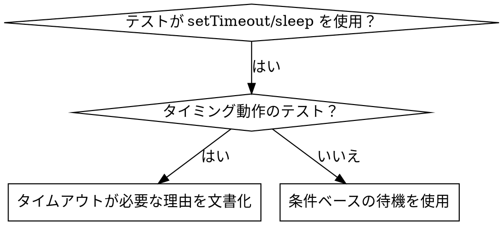

# 条件ベースの待機

## 概要

フレーキーなテストは、任意の遅延でタイミングを推測することが多い。これにより、高速なマシンではパスするが負荷時や CI では失敗する競合状態が生まれる。

**基本原則:** 所要時間の推測ではなく、実際に関心のある条件を待つ。

## いつ使うか



**使用する場面:**
- テストに任意の遅延がある（`setTimeout`、`sleep`、`time.sleep()`）
- テストがフレーキー（時々パス、負荷時に失敗）
- 並列実行時にテストがタイムアウト
- 非同期操作の完了を待つ場合

**使用しない場面:**
- 実際のタイミング動作のテスト（デバウンス、スロットル間隔）
- 任意のタイムアウトを使う場合は必ず理由を文書化する

## 基本パターン

```typescript
// ❌ 変更前: タイミングの推測
await new Promise(r => setTimeout(r, 50));
const result = getResult();
expect(result).toBeDefined();

// ✅ 変更後: 条件を待つ
await waitFor(() => getResult() !== undefined);
const result = getResult();
expect(result).toBeDefined();
```

## クイックパターン

| シナリオ | パターン |
|----------|---------|
| イベントを待つ | `waitFor(() => events.find(e => e.type === 'DONE'))` |
| 状態を待つ | `waitFor(() => machine.state === 'ready')` |
| 件数を待つ | `waitFor(() => items.length >= 5)` |
| ファイルを待つ | `waitFor(() => fs.existsSync(path))` |
| 複合条件 | `waitFor(() => obj.ready && obj.value > 10)` |

## 実装

汎用ポーリング関数:
```typescript
async function waitFor<T>(
  condition: () => T | undefined | null | false,
  description: string,
  timeoutMs = 5000
): Promise<T> {
  const startTime = Date.now();

  while (true) {
    const result = condition();
    if (result) return result;

    if (Date.now() - startTime > timeoutMs) {
      throw new Error(`Timeout waiting for ${description} after ${timeoutMs}ms`);
    }

    await new Promise(r => setTimeout(r, 10)); // 10ms ごとにポーリング
  }
}
```

ドメイン固有のヘルパー（`waitForEvent`、`waitForEventCount`、`waitForEventMatch`）を含む完全な実装は、このディレクトリの `condition-based-waiting-example.ts` を参照。

## よくある間違い

**❌ ポーリングが速すぎる:** `setTimeout(check, 1)` — CPU を浪費
**✅ 修正:** 10ms ごとにポーリング

**❌ タイムアウトなし:** 条件が満たされなければ永遠にループ
**✅ 修正:** 明確なエラーメッセージ付きのタイムアウトを必ず含める

**❌ 古いデータ:** ループ前に状態をキャッシュ
**✅ 修正:** 新鮮なデータのためにループ内で getter を呼ぶ

## 任意のタイムアウトが正しい場合

```typescript
// ツールが 100ms ごとにティック — 部分出力を検証するために 2 ティック必要
await waitForEvent(manager, 'TOOL_STARTED'); // まず: 条件を待つ
await new Promise(r => setTimeout(r, 200));   // 次に: タイミング動作を待つ
// 200ms = 100ms 間隔で 2 ティック — 文書化済みで正当化済み
```

**要件:**
1. まずトリガー条件を待つ
2. 既知のタイミングに基づく（推測ではなく）
3. 理由を説明するコメント

## 実績

デバッグセッション（2025-10-03）から:
- 3ファイルにわたる15のフレーキーテストを修正
- パス率: 60% → 100%
- 実行時間: 40% 高速化
- 競合状態なし
