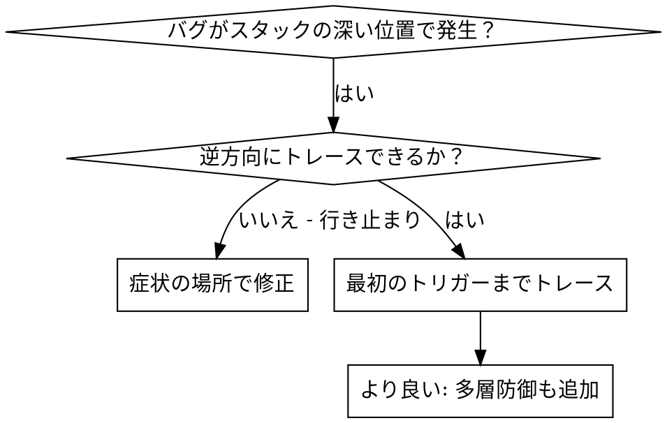
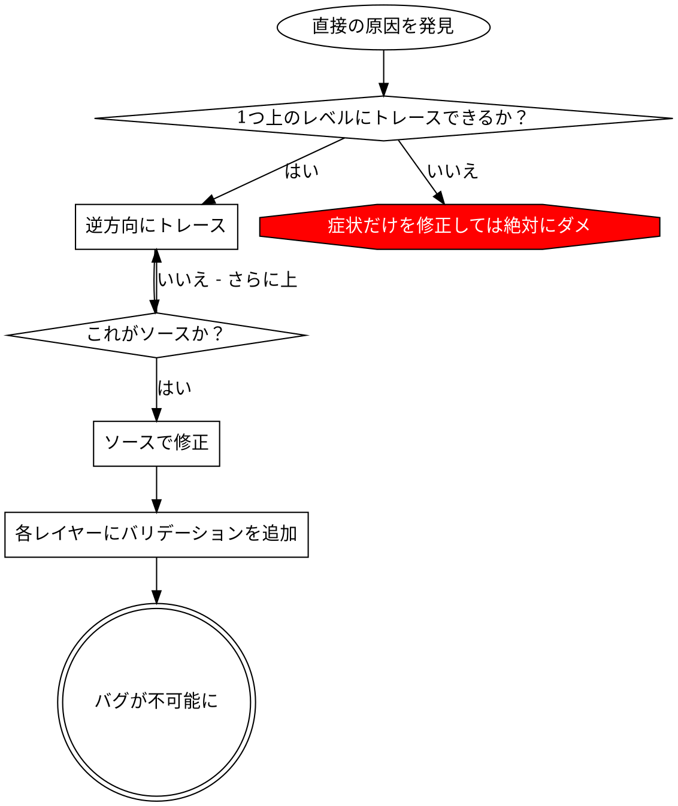

# 根本原因トレーシング

## 概要

バグはコールスタックの深い位置で顕在化することが多い（間違ったディレクトリでの git init、間違った場所に作成されたファイル、間違ったパスで開かれた DB）。本能的にエラーが出た場所で修正したくなるが、それは症状の治療にすぎない。

**基本原則:** コールチェーンを逆方向にトレースして最初のトリガーを見つけ、ソースで修正する。

## いつ使うか



**使用する場面:**
- エラーが実行の深い位置で発生（エントリポイントではなく）
- スタックトレースが長いコールチェーンを示す
- 不正なデータがどこで発生したか不明
- どのテスト/コードが問題を引き起こしているか特定が必要

## トレーシングプロセス

### 1. 症状を観察する
```
Error: git init failed in /Users/jesse/project/packages/core
```

### 2. 直接の原因を見つける
**どのコードが直接これを引き起こしているか？**
```typescript
await execFileAsync('git', ['init'], { cwd: projectDir });
```

### 3. 問う: 何がこれを呼んだか？
```typescript
WorktreeManager.createSessionWorktree(projectDir, sessionId)
  → called by Session.initializeWorkspace()
  → called by Session.create()
  → called by test at Project.create()
```

### 4. さらに上へトレースする
**どの値が渡されたか？**
- `projectDir = ''`（空文字列！）
- 空文字列を `cwd` にすると `process.cwd()` に解決される
- それはソースコードのディレクトリ！

### 5. 最初のトリガーを見つける
**空文字列はどこから来たか？**
```typescript
const context = setupCoreTest(); // { tempDir: '' } を返す
Project.create('name', context.tempDir); // beforeEach の前にアクセス！
```

## スタックトレースの追加

手動でトレースできない場合、インストルメンテーションを追加する:

```typescript
// 問題のある操作の前に
async function gitInit(directory: string) {
  const stack = new Error().stack;
  console.error('DEBUG git init:', {
    directory,
    cwd: process.cwd(),
    nodeEnv: process.env.NODE_ENV,
    stack,
  });

  await execFileAsync('git', ['init'], { cwd: directory });
}
```

**重要:** テストでは `console.error()` を使う（ロガーは表示されない場合がある）

**実行してキャプチャ:**
```bash
npm test 2>&1 | grep 'DEBUG git init'
```

**スタックトレースを分析:**
- テストファイル名を探す
- 呼び出しをトリガーした行番号を見つける
- パターンを特定する（同じテスト？同じパラメータ？）

## テスト汚染の原因を特定する

テスト中に何かが発生するが、どのテストが原因かわからない場合:

このディレクトリのバイセクションスクリプト `find-polluter.sh` を使用:

```bash
./find-polluter.sh '.git' 'src/**/*.test.ts'
```

テストを1つずつ実行し、最初の汚染元で停止する。使用方法はスクリプトを参照。

## 実例: 空の projectDir

**症状:** `.git` が `packages/core/`（ソースコード）に作成される

**トレースチェーン:**
1. `git init` が `process.cwd()` で実行 ← 空の cwd パラメータ
2. WorktreeManager が空の projectDir で呼ばれた
3. Session.create() が空文字列を渡した
4. テストが beforeEach の前に `context.tempDir` にアクセスした
5. setupCoreTest() が初期値として `{ tempDir: '' }` を返す

**根本原因:** トップレベルの変数初期化が空の値にアクセス

**修正:** tempDir を getter にし、beforeEach の前にアクセスするとエラーをスローするようにした

**さらに多層防御を追加:**
- レイヤー 1: Project.create() がディレクトリを検証
- レイヤー 2: WorkspaceManager が空でないことを検証
- レイヤー 3: NODE_ENV ガードがテスト中に tmpdir 外での git init を拒否
- レイヤー 4: git init 前のスタックトレースログ

## 基本原則



**エラーが出た場所だけを修正してはならない。** 逆方向にトレースして最初のトリガーを見つけること。

## スタックトレースのコツ

**テスト内:** `console.error()` を使う。ロガーは抑制されている場合がある
**操作の前に:** 失敗後ではなく、危険な操作の前にログを出す
**コンテキストを含める:** ディレクトリ、cwd、環境変数、タイムスタンプ
**スタックをキャプチャ:** `new Error().stack` が完全なコールチェーンを表示

## 実績

デバッグセッション（2025-10-03）から:
- 5レベルのトレースで根本原因を発見
- ソースで修正（getter バリデーション）
- 4レイヤーの防御を追加
- 1847テストパス、汚染ゼロ
