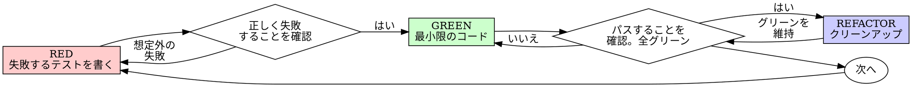

# テスト駆動開発（TDD）

## 概要

まずテストを書く。失敗を確認する。テストを通す最小限のコードを書く。

**基本原則:** テストの失敗を確認していなければ、それが正しいものをテストしているかわからない。

**ルールの文言に違反することは、ルールの精神に違反することである。**

## いつ使うか

**常に:** 新機能 / バグ修正 / リファクタリング / 振る舞いの変更

**例外（人間のパートナーに確認):** 使い捨てのプロトタイプ / 生成されたコード / 設定ファイル

「今回だけ TDD をスキップしよう」と思ったら？ やめること。それは合理化だ。
合理化に揺らいだら [references/rationalizations.md](references/rationalizations.md) を読む。

## 鉄の掟

```
失敗するテストなしにプロダクションコードを書いてはならない
```

テストより先にコードを書いた？ 削除する。最初からやり直す。

**例外なし:** 「参考」として残さない / テストを書きながら「適応」させない / 見ない / 削除とは削除である。

## Red-Green-Refactor



### RED — 失敗するテストを書く

何が起きるべきかを示す、最小限のテストを 1 つ書く。

<Good>
```typescript
test('失敗した操作を3回リトライする', async () => {
  let attempts = 0;
  const operation = () => {
    attempts++;
    if (attempts < 3) throw new Error('fail');
    return 'success';
  };

  const result = await retryOperation(operation);

  expect(result).toBe('success');
  expect(attempts).toBe(3);
});
```
明確な名前、実際の振る舞いをテスト、1 つのこと
</Good>

<Bad>
```typescript
test('retry works', async () => {
  const mock = jest.fn()
    .mockRejectedValueOnce(new Error())
    .mockRejectedValueOnce(new Error())
    .mockResolvedValueOnce('success');
  await retryOperation(mock);
  expect(mock).toHaveBeenCalledTimes(3);
});
```
曖昧な名前、コードではなくモックをテストしている
</Bad>

**要件:** 1 つの振る舞い / 明確な名前 / 実際のコード（モックは不可避な場合のみ）

### RED を確認 — 失敗を確認する

**必須。絶対にスキップしない。**

```bash
npm test path/to/test.test.ts
```

確認事項:
- テストが失敗する（エラーではなく）
- 失敗メッセージが想定通り
- 機能が未実装だから失敗する（タイポではなく）

**テストがパスした？** 既存の振る舞いをテストしている。テストを修正する。
**テストがエラーになった？** エラーを修正し、正しく失敗するまで再実行する。

### GREEN — 最小限のコード

テストをパスさせる最もシンプルなコードを書く。機能を追加したり、他のコードをリファクタしたり、テスト以上の「改善」をしない。

### GREEN を確認 — パスを確認する

**必須。** テストがパス・他のテストも依然パス・出力がクリーン（エラー、警告なし）。

**テストが失敗した？** テストではなくコードを修正。
**他のテストが失敗した？** 今すぐ修正。

### REFACTOR — クリーンアップ

グリーンの後にのみ:重複を除去 / 名前を改善 / ヘルパーを抽出。
テストをグリーンに保つ。振る舞いを追加しない。

## 良いテスト

| 品質 | 良い | 悪い |
|---------|------|-----|
| **最小限** | 1 つのこと。名前に「and」があるなら分割。 | `test('メール、ドメイン、空白を検証する')` |
| **明確** | 名前が振る舞いを説明 | `test('test1')` |
| **意図を示す** | 望ましい API を実演 | コードが何をすべきかを曖昧にする |

## 検証チェックリスト

作業完了のマーク前に:

- [ ] すべての新しい関数/メソッドにテストがある
- [ ] 各テストの失敗を実装前に確認した
- [ ] 各テストが想定通りの理由で失敗した（タイポではなく機能未実装）
- [ ] 各テストをパスさせる最小限のコードを書いた
- [ ] すべてのテストがパス
- [ ] 出力がクリーン（エラー、警告なし）
- [ ] テストが実際のコードを使用（モックは不可避な場合のみ）
- [ ] エッジケースとエラーをカバー

すべてのチェックが付けられない？ TDD をスキップしている。やり直す。

## 行き詰まったとき

| 問題 | 解決策 |
|---------|----------|
| テスト方法がわからない | 理想的な API を書く。アサーションを先に書く。人間のパートナーに聞く。 |
| テストが複雑すぎる | 設計が複雑すぎる。インターフェースを簡素化。 |
| すべてをモックしないといけない | 密結合すぎる。依存性注入を使う。 |
| テストセットアップが巨大 | ヘルパーを抽出。それでも複雑なら設計を簡素化。 |

## 関連リファレンス

- [references/rationalizations.md](references/rationalizations.md) — 合理化テーブル、危険信号、「順序が重要な理由」の詳細反論
- [references/testing-anti-patterns.md](references/testing-anti-patterns.md) — モック・テスト専用メソッド等のアンチパターン（テスト作成・モック追加時に必読）

## デバッグとの統合

バグを見つけた？ それを再現する失敗するテストを書く。TDD サイクルに従う。テストが修正を証明し、リグレッションを防止する。
テストなしにバグを修正しない。
