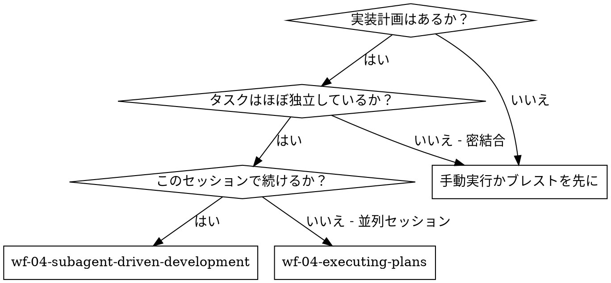
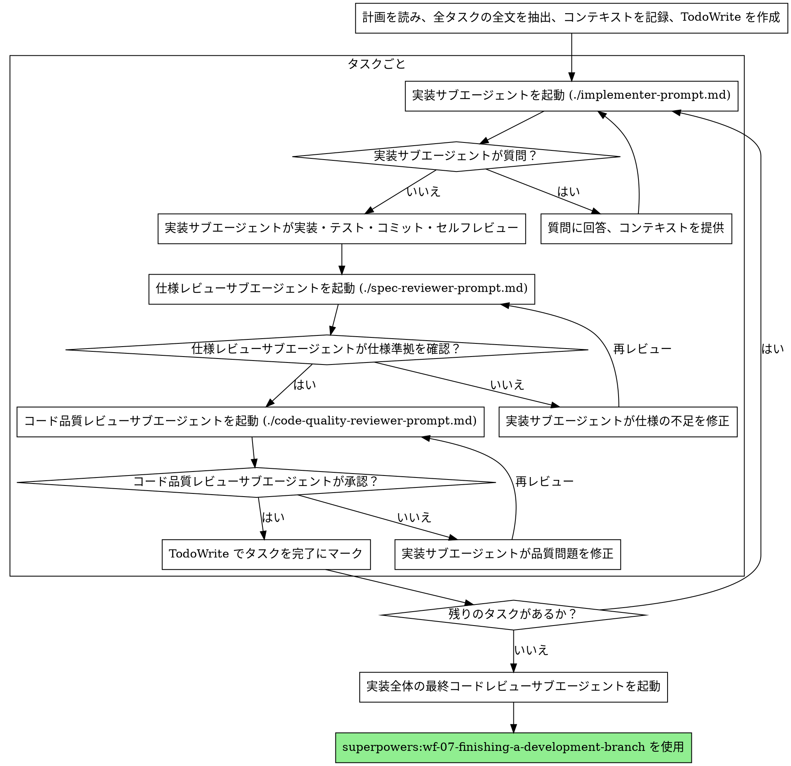

# サブエージェント駆動開発

タスクごとに新しいサブエージェントを起動して計画を実行し、各タスク完了後に2段階レビュー（仕様準拠レビュー → コード品質レビュー）を行う。

**なぜサブエージェントか:** 専門的なエージェントにタスクを委譲し、コンテキストを分離する。指示と必要なコンテキストを正確に構成することで、エージェントがタスクに集中して成功できるようにする。セッションのコンテキストや履歴を引き継がせてはならない — 必要なものだけを正確に構成して渡す。これにより、自分自身のコンテキストも調整作業のために確保される。

**基本原則:** タスクごとに新しいサブエージェント + 2段階レビュー（仕様 → 品質）= 高品質かつ高速なイテレーション

## いつ使うか



**wf-04-executing-plans（並列セッション）との違い:**
- 同一セッション内で完結（コンテキストスイッチなし）
- タスクごとに新しいサブエージェント（コンテキスト汚染なし）
- 各タスク後に2段階レビュー：仕様準拠 → コード品質
- 高速なイテレーション（タスク間に人の介入不要）

## プロセス



## モデル選択

コストと速度を最適化するため、各役割に対して必要十分なモデルを使用する。

**機械的な実装タスク**（独立した関数、明確な仕様、1-2ファイル）：高速・低コストモデルを使用。計画が十分に詳細であれば、大半の実装タスクは機械的になる。

**統合・判断を要するタスク**（複数ファイル連携、パターンマッチング、デバッグ）：標準モデルを使用。

**設計・アーキテクチャ・レビュータスク**：利用可能な最も高性能なモデルを使用。

**タスク複雑度の判断基準:**
- 1-2ファイルで完全な仕様あり → 低コストモデル
- 複数ファイルで統合の懸念あり → 標準モデル
- 設計判断やコードベース全体の理解が必要 → 最高性能モデル

## 実装サブエージェントのステータス処理

実装サブエージェントは4種類のステータスを報告する。それぞれ適切に対応すること。

**DONE:** 仕様準拠レビューに進む。

**DONE_WITH_CONCERNS:** 実装は完了したが懸念事項がある。レビューに進む前に懸念を確認する。正確性やスコープに関する懸念であれば、レビュー前に対処する。観察事項（例：「このファイルが大きくなっている」）であれば、記録してレビューに進む。

**NEEDS_CONTEXT:** 提供されなかった情報が必要。不足しているコンテキストを提供して再度起動する。

**BLOCKED:** タスクを完了できない。ブロッカーを評価する：
1. コンテキストの問題であれば、より多くのコンテキストを提供して同じモデルで再起動
2. より高度な推論が必要であれば、より高性能なモデルで再起動
3. タスクが大きすぎれば、より小さな単位に分割
4. 計画自体に問題があれば、人間にエスカレーション

エスカレーションを**絶対に無視しない**。変更なしに同じモデルでリトライさせない。実装サブエージェントが行き詰まったと報告した場合、何かを変える必要がある。

## プロンプトテンプレート

- `./implementer-prompt.md` - 実装サブエージェント起動用
- `./spec-reviewer-prompt.md` - 仕様準拠レビューサブエージェント起動用
- `./code-quality-reviewer-prompt.md` - コード品質レビューサブエージェント起動用

## ワークフロー例

```
あなた: サブエージェント駆動開発でこの計画を実行します。

[計画ファイルを一度読む: docs/superpowers/plans/feature-plan.md]
[5つのタスクすべてを全文とコンテキスト付きで抽出]
[全タスクで TodoWrite を作成]

タスク 1: Hook インストールスクリプト

[タスク 1 のテキストとコンテキストを取得（抽出済み）]
[全タスクテキスト + コンテキスト付きで実装サブエージェントを起動]

実装サブエージェント: 「作業開始前に確認 — Hook はユーザーレベルとシステムレベルのどちらにインストールすべきですか？」

あなた: 「ユーザーレベル（~/.config/superpowers/hooks/）」

実装サブエージェント: 「了解しました。実装を開始します...」
[後に] 実装サブエージェント:
  - install-hook コマンドを実装
  - テストを追加、5/5 パス
  - セルフレビュー: --force フラグの漏れを発見、追加済み
  - コミット済み

[仕様準拠レビューサブエージェントを起動]
仕様レビュー: ✅ 仕様準拠 - 全要件充足、余分なものなし

[git SHA を取得、コード品質レビューサブエージェントを起動]
コードレビュー: 長所: テストカバレッジ良好、クリーン。問題: なし。承認。

[タスク 1 を完了にマーク]

タスク 2: リカバリーモード

[タスク 2 のテキストとコンテキストを取得（抽出済み）]
[全タスクテキスト + コンテキスト付きで実装サブエージェントを起動]

実装サブエージェント: [質問なし、作業開始]
実装サブエージェント:
  - verify/repair モードを追加
  - 8/8 テストパス
  - セルフレビュー: 問題なし
  - コミット済み

[仕様準拠レビューサブエージェントを起動]
仕様レビュー: ❌ 問題あり:
  - 不足: 進捗報告（仕様に「100件ごとに報告」と記載）
  - 余分: --json フラグを追加（要求なし）

[実装サブエージェントが問題を修正]
実装サブエージェント: --json フラグを削除、進捗報告を追加

[仕様レビューサブエージェントが再レビュー]
仕様レビュー: ✅ 仕様準拠

[コード品質レビューサブエージェントを起動]
コードレビュー: 長所: 堅実。問題（重要）: マジックナンバー（100）

[実装サブエージェントが修正]
実装サブエージェント: PROGRESS_INTERVAL 定数を抽出

[コードレビューサブエージェントが再レビュー]
コードレビュー: ✅ 承認

[タスク 2 を完了にマーク]

...

[全タスク完了後]
[最終コードレビューサブエージェントを起動]
最終レビュー: 全要件充足、マージ可能

完了！
```

## メリット

**手動実行との比較:**
- サブエージェントが自然に TDD を実践
- タスクごとにフレッシュなコンテキスト（混乱なし）
- 並列安全（サブエージェント間の干渉なし）
- サブエージェントが質問可能（作業前も作業中も）

**wf-04-executing-plans との比較:**
- 同一セッション内（引き継ぎなし）
- 継続的な進捗（待ち時間なし）
- レビューチェックポイントが自動

**効率の向上:**
- ファイル読み込みのオーバーヘッドなし（コントローラーが全文を提供）
- コントローラーが必要なコンテキストを正確にキュレーション
- サブエージェントが最初から完全な情報を取得
- 質問が作業前に浮上（作業後ではなく）

**品質ゲート:**
- セルフレビューが引き継ぎ前に問題を検出
- 2段階レビュー：仕様準拠 → コード品質
- レビューループにより修正が実際に機能することを確認
- 仕様準拠レビューが過剰/不足な実装を防止
- コード品質レビューが実装の品質を保証

**コスト:**
- サブエージェント呼び出し回数が多い（タスクごとに実装 + レビュー2つ）
- コントローラーの準備作業が多い（全タスクの事前抽出）
- レビューループでイテレーションが増加
- ただし問題を早期に検出（後からデバッグするより安価）

## 禁止事項

**絶対にしないこと:**
- ユーザーの明示的な同意なしに main/master ブランチで実装を開始
- レビューをスキップ（仕様準拠もコード品質も）
- 未修正の問題を残したまま先に進む
- 複数の実装サブエージェントを並列起動（コンフリクトの原因）
- サブエージェントに計画ファイルを読ませる（全文を提供すること）
- 状況設定のコンテキストを省略（サブエージェントはタスクの位置づけを理解する必要がある）
- サブエージェントの質問を無視（回答してから作業を進めさせる）
- 仕様準拠を「だいたい合っている」で済ませる（仕様レビューで問題あり = 未完了）
- レビューループをスキップ（レビューで問題あり = 実装が修正 = 再レビュー）
- 実装サブエージェントのセルフレビューで正式レビューを代替（両方必要）
- **仕様準拠が ✅ になる前にコード品質レビューを開始**（順序違反）
- どちらかのレビューに未解決の問題がある状態で次のタスクに進む

**サブエージェントが質問した場合:**
- 明確かつ完全に回答する
- 必要に応じて追加のコンテキストを提供する
- 実装を急がせない

**レビューで問題が見つかった場合:**
- 実装サブエージェント（同じサブエージェント）が修正する
- レビューサブエージェントが再レビューする
- 承認されるまで繰り返す
- 再レビューをスキップしない

**サブエージェントがタスクに失敗した場合:**
- 具体的な指示を持つ修正サブエージェントを起動する
- 手動で修正しようとしない（コンテキスト汚染）

## 連携

**必須のワークフロースキル:**
- **superpowers:wf-02-using-git-worktrees** - 必須: 作業開始前に分離されたワークスペースを構築
- **superpowers:wf-03-writing-plans** - このスキルが実行する計画を作成
- **superpowers:wf-05-requesting-code-review** - レビューサブエージェント用のコードレビューテンプレート
- **superpowers:wf-07-finishing-a-development-branch** - 全タスク完了後の開発完了処理

**サブエージェントが使用すべきスキル:**
- **superpowers:wf-common-test-driven-development** - サブエージェントが各タスクで TDD を実践

**代替ワークフロー:**
- **superpowers:wf-04-executing-plans** - 同一セッション実行ではなく並列セッションで実行する場合
