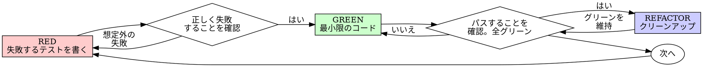

# テスト駆動開発（TDD）

## 概要

まずテストを書く。失敗を確認する。テストを通す最小限のコードを書く。

**基本原則:** テストの失敗を確認していなければ、それが正しいものをテストしているかわからない。

**ルールの文言に違反することは、ルールの精神に違反することである。**

## いつ使うか

**常に:**
- 新機能
- バグ修正
- リファクタリング
- 振る舞いの変更

**例外（人間のパートナーに確認すること）:**
- 使い捨てのプロトタイプ
- 生成されたコード
- 設定ファイル

「今回だけ TDD をスキップしよう」と思ったら？ やめること。それは合理化だ。

## 鉄の掟

```
失敗するテストなしにプロダクションコードを書いてはならない
```

テストより先にコードを書いた？ 削除する。最初からやり直す。

**例外なし:**
- 「参考」として残さない
- テストを書きながら「適応」させない
- 見ない
- 削除とは削除である

テストからフレッシュに実装する。以上。

## Red-Green-Refactor



### RED - 失敗するテストを書く

何が起きるべきかを示す、最小限のテストを1つ書く。

<Good>
```typescript
test('失敗した操作を3回リトライする', async () => {
  let attempts = 0;
  const operation = () => {
    attempts++;
    if (attempts < 3) throw new Error('fail');
    return 'success';
  };

  const result = await retryOperation(operation);

  expect(result).toBe('success');
  expect(attempts).toBe(3);
});
```
明確な名前、実際の振る舞いをテスト、1つのこと
</Good>

<Bad>
```typescript
test('retry works', async () => {
  const mock = jest.fn()
    .mockRejectedValueOnce(new Error())
    .mockRejectedValueOnce(new Error())
    .mockResolvedValueOnce('success');
  await retryOperation(mock);
  expect(mock).toHaveBeenCalledTimes(3);
});
```
曖昧な名前、コードではなくモックをテストしている
</Bad>

**要件:**
- 1つの振る舞い
- 明確な名前
- 実際のコード（モックは不可避な場合のみ）

### RED を確認 - 失敗を確認する

**必須。絶対にスキップしない。**

```bash
npm test path/to/test.test.ts
```

確認事項:
- テストが失敗する（エラーではなく）
- 失敗メッセージが想定通り
- 機能が未実装だから失敗する（タイポではなく）

**テストがパスした？** 既存の振る舞いをテストしている。テストを修正する。

**テストがエラーになった？** エラーを修正し、正しく失敗するまで再実行する。

### GREEN - 最小限のコード

テストをパスさせる最もシンプルなコードを書く。

<Good>
```typescript
async function retryOperation<T>(fn: () => Promise<T>): Promise<T> {
  for (let i = 0; i < 3; i++) {
    try {
      return await fn();
    } catch (e) {
      if (i === 2) throw e;
    }
  }
  throw new Error('unreachable');
}
```
テストをパスさせるのに十分な最小限
</Good>

<Bad>
```typescript
async function retryOperation<T>(
  fn: () => Promise<T>,
  options?: {
    maxRetries?: number;
    backoff?: 'linear' | 'exponential';
    onRetry?: (attempt: number) => void;
  }
): Promise<T> {
  // YAGNI
}
```
過剰設計
</Bad>

機能を追加したり、他のコードをリファクタしたり、テスト以上の「改善」をしない。

### GREEN を確認 - パスを確認する

**必須。**

```bash
npm test path/to/test.test.ts
```

確認事項:
- テストがパスする
- 他のテストも依然パスする
- 出力がクリーン（エラー、警告なし）

**テストが失敗した？** テストではなくコードを修正する。

**他のテストが失敗した？** 今すぐ修正する。

### REFACTOR - クリーンアップ

グリーンの後にのみ:
- 重複を除去
- 名前を改善
- ヘルパーを抽出

テストをグリーンに保つ。振る舞いを追加しない。

### 繰り返し

次の機能のために次の失敗するテストを書く。

## 良いテスト

| 品質 | 良い | 悪い |
|---------|------|-----|
| **最小限** | 1つのこと。名前に「and」があるなら分割する。 | `test('メール、ドメイン、空白を検証する')` |
| **明確** | 名前が振る舞いを説明 | `test('test1')` |
| **意図を示す** | 望ましい API を実演 | コードが何をすべきかを曖昧にする |

## 順序が重要な理由

**「後でテストを書いて動作を確認する」**

後から書いたテストはすぐにパスする。すぐにパスすることは何も証明しない:
- 間違ったものをテストしているかもしれない
- 振る舞いではなく実装をテストしているかもしれない
- 忘れたエッジケースを見逃しているかもしれない
- テストがバグを捕捉するところを見ていない

テストファーストは失敗を確認することを強制し、テストが実際に何かをテストしていることを証明する。

**「すべてのエッジケースを手動でテスト済み」**

手動テストはアドホックだ。すべてをテストしたと思っても:
- 何をテストしたかの記録がない
- コード変更時に再実行できない
- プレッシャーの下でケースを忘れやすい
- 「試したときは動いた」≠ 包括的

自動テストは体系的だ。毎回同じ方法で実行される。

**「X時間の作業を削除するのは無駄」**

埋没費用の誤謬。時間は既に過ぎている。今の選択肢:
- 削除して TDD で書き直す（X時間追加、高い信頼性）
- 残して後からテストを追加（30分、低い信頼性、バグの可能性大）

「無駄」は信頼できないコードを残すことだ。実際のテストのない動作コードは技術的負債。

**「TDD は教条的。実用的であることは適応すること」**

TDD は実用的だ:
- コミット前にバグを発見（後からデバッグするより速い）
- リグレッションを防止（テストが即座に破綻を検出）
- 振る舞いを文書化（テストがコードの使い方を示す）
- リファクタリングを可能に（自由に変更、テストが破綻を検出）

「実用的な」ショートカット = 本番でのデバッグ = より遅い。

**「後からのテストでも同じ目標を達成できる — 形式ではなく精神だ」**

違う。後からのテストは「これは何をするか？」に答える。先のテストは「これは何をすべきか？」に答える。

後からのテストは実装にバイアスがかかる。要求されたものではなく、作ったものをテストする。発見されたエッジケースではなく、記憶したエッジケースを検証する。

先のテストは実装前にエッジケースの発見を強制する。後からのテストはすべてを記憶していたかを検証する（記憶していない）。

30分の後付けテスト ≠ TDD。カバレッジは得られるが、テストが機能する証明は失われる。

## よくある合理化

| 言い訳 | 現実 |
|--------|---------|
| 「テストするほど複雑じゃない」 | シンプルなコードも壊れる。テストは30秒で書ける。 |
| 「後でテストする」 | すぐにパスするテストは何も証明しない。 |
| 「後からのテストでも同じ目標を達成」 | 後から = 「これは何をするか？」先から = 「これは何をすべきか？」 |
| 「手動テスト済み」 | アドホック ≠ 体系的。記録なし、再実行不可。 |
| 「X時間の削除は無駄」 | 埋没費用の誤謬。未検証コードの保持は技術的負債。 |
| 「参考として残してテストを先に書く」 | 適応してしまう。それは後付けテスト。削除は削除。 |
| 「先に探索が必要」 | 問題ない。探索を捨てて、TDD で始める。 |
| 「テストが難しい = 設計が不明確」 | テストに耳を傾ける。テストしにくい = 使いにくい。 |
| 「TDD は遅くなる」 | TDD はデバッグより速い。実用的 = テストファースト。 |
| 「手動テストの方が速い」 | 手動はエッジケースを証明しない。変更のたびに再テストする。 |
| 「既存コードにテストがない」 | 改善している。既存コードにテストを追加する。 |

## 危険信号 - 止まってやり直す

- テスト前にコード
- 実装後にテスト
- テストがすぐにパス
- テストがなぜ失敗したか説明できない
- テストを「後で」追加
- 「今回だけ」という合理化
- 「手動テスト済み」
- 「後からのテストでも同じ目的を達成」
- 「形式ではなく精神だ」
- 「参考として残す」「既存コードを適応」
- 「X時間かけたのに削除は無駄」
- 「TDD は教条的、自分は実用的」
- 「これは違うから...」

**これらはすべて次を意味する: コードを削除する。TDD でやり直す。**

## 例: バグ修正

**バグ:** 空のメールアドレスが受け入れられる

**RED**
```typescript
test('空のメールを拒否する', async () => {
  const result = await submitForm({ email: '' });
  expect(result.error).toBe('Email required');
});
```

**RED を確認**
```bash
$ npm test
FAIL: expected 'Email required', got undefined
```

**GREEN**
```typescript
function submitForm(data: FormData) {
  if (!data.email?.trim()) {
    return { error: 'Email required' };
  }
  // ...
}
```

**GREEN を確認**
```bash
$ npm test
PASS
```

**REFACTOR**
必要に応じて複数フィールドのバリデーションを抽出。

## 検証チェックリスト

作業完了のマーク前に:

- [ ] すべての新しい関数/メソッドにテストがある
- [ ] 各テストの失敗を実装前に確認した
- [ ] 各テストが想定通りの理由で失敗した（タイポではなく機能未実装）
- [ ] 各テストをパスさせる最小限のコードを書いた
- [ ] すべてのテストがパス
- [ ] 出力がクリーン（エラー、警告なし）
- [ ] テストが実際のコードを使用（モックは不可避な場合のみ）
- [ ] エッジケースとエラーをカバー

すべてのチェックが付けられない？ TDD をスキップしている。やり直す。

## 行き詰まったとき

| 問題 | 解決策 |
|---------|----------|
| テスト方法がわからない | 理想的な API を書く。アサーションを先に書く。人間のパートナーに聞く。 |
| テストが複雑すぎる | 設計が複雑すぎる。インターフェースを簡素化する。 |
| すべてをモックしないといけない | コードが密結合すぎる。依存性注入を使う。 |
| テストセットアップが巨大 | ヘルパーを抽出。それでも複雑なら設計を簡素化。 |

## デバッグとの統合

バグを見つけた？ それを再現する失敗するテストを書く。TDD サイクルに従う。テストが修正を証明し、リグレッションを防止する。

テストなしにバグを修正しない。

## テストのアンチパターン

モックやテストユーティリティを追加する際は @testing-anti-patterns.md を読んで、よくある落とし穴を避ける:
- モックの振る舞いではなく実際の振る舞いをテストする
- プロダクションクラスにテスト専用メソッドを追加しない
- 依存関係を理解せずにモックしない

## 最後のルール

```
プロダクションコード → テストが存在し、先に失敗したこと
それ以外 → TDD ではない
```

人間のパートナーの許可なしに例外はない。
