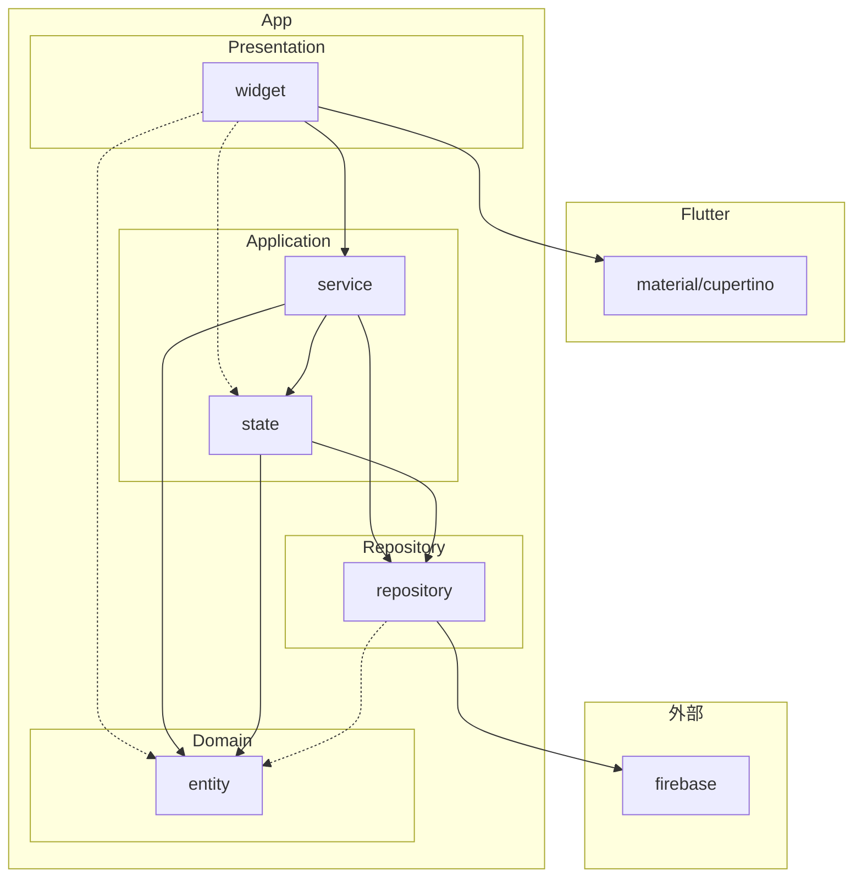

# アーキテクチャについて

## 概要

- 「presentation」「application」「domain」「repository」の4層に分割
- featureファースト
- lib配下にcommon_widget, util, feature
- 以下を必要に応じて各feature配下に作成
  - presentation
  - application
  - domain
  - repository
  - util

参考  
[Flutter App Architecture with Riverpod: An Introduction](https://codewithandrea.com/articles/flutter-app-architecture-riverpod-introduction/)  
[Flutter Project Structure: Feature-first or Layer-first?](https://codewithandrea.com/articles/flutter-project-structure/)

## 詳細

### common_widget

- 複数のfeatureで使うような汎用的なwidgetを格納する

### util

- アプリ全体で使用する汎用的なコードを格納する
  - constやextensionなど

### feature/presentation

- UIに関するファイルを格納する
- 画面遷移やダイアログ、スナックバー等の表示も行う

### feature/application

- 状態（state）を保持するクラスを格納する
  - Riverpodで状態を管理する
- serviceクラスを格納する
  - presentationとrepositoryの橋渡しや、ビジネスロジックの実装を担う
- 原則UnitTest書く

### feature/domain

- アプリ全体で使用するようなEntityを格納する
  - Entityと強く結びつくロジックも格納する
- Freezedでイミュータブルにする
- 原則UnitTest書く

### feature/repository
- 外部と直接通信するようなクラスを格納する
  - Firebase関連の処理がメイン
  - Hiveなど端末のローカルDB関連の処理も含める
- repository内で一時的に使うようなEntityを格納する

### feature/util

- 使用範囲がfeature内に限定される汎用なコードを格納する

## 依存関係

※ 実線はcall, 点線はwatch

### importの目安

理想の形であり、あくまで目安。  
とはいえ、「〇〇 × 外部パッケージ」以外のところは守りたい。

#### プロジェクト外（絶対パスで指定するやつ）

|                | material / cupertino | riverpod | 外部パッケージ                 |
|----------------|----------------------|----------|-------------------------     |
| presentation   | ○                    | ○        | UI系                         |
| application    | ✗                    | ○        | ✗                            |
| domain         | ✗                    | ✗        | freezed                      |
| repository     | ✗                    | ○        | 外部通信で使う系(firebase系など) |

#### プロジェクト内（相対パスで指定するやつ）
|                | presentation | application | domain | repository |
|----------------|--------------|-------------|--------|------------|
| presentation   | ○            | ○           | ○      | ✗          |
| application    | ✗            | ○           | ○      | ○          |
| domain         | ✗            | ✗           | ○      | ✗          |
| repository     | ✗            | ✗           | ○      | ✗          |

※「presentation × presentationなど」、同じ層同士の場合は、同じ層の他ファイルをimportするかどうか

## ファイル, クラスの命名規則

### presentation

#### クラス名

- ページ系: 〇〇Page
- コンポーネント系: 〇〇Text, 〇〇Tile, 〇〇Buttonなど、語尾にWidget名をつける
  - 困ったら〇〇WidgetでOK

#### ファイル名

クラス名に対応させる。  
例: LarryPage -> larry_page.dart

### application

#### クラス名

- Service系: 〇〇Service
  - ControllerやUseCaseなど、他に適切が表現がありそう
- 関数ベースのProvider: 〇〇
  - クラスではないが、便宜上ここに記載

#### ファイル名

Service系はクラス名に対応させる。  

関数ベースのProviderは、「〇〇_provider(s).dart」というファイルに、いい感じにまとめる。

### domain

#### クラス名

- Entityの名称

#### ファイル名

クラス名に対応させる。

### repository

#### クラス名

- 〇〇Repository

#### ファイル名

クラス名に対応させる。

### 補足

VS Codeの設定で、クラス名変更時にファイル名が自動的に変更されるようにできる。  
※クラス名とファイル名が一致している場合のみ（大文字小文字、アンダースコアは無視される）

参考  
https://zenn.dev/inari_sushio/articles/0f4c606c8340ee#クラス名変更時にファイル名を自動で変える