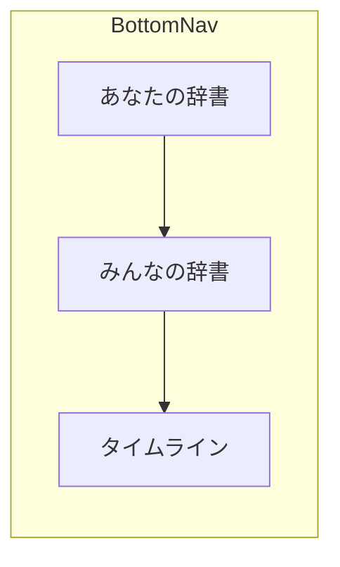

# UI 刷新の作り直し（develop ベース）

## 目的
#248 を破棄し、develop の既存 UI をベースに意図差分だけ実装する。

## 完了条件
- #248・#240–#247 Close、#187 更新、Draft 掃除 Issue (#252) 作成済み
- 意図差分のみが入っている
- analyze / test 通過

---

# develop からの UI 刷新の作り直し

## 方針

- **Approach B**: [#248](https://github.com/salan70/teigiii_app/pull/248)（`codex/187-mobile-app-ui`）は捨てる。新ブランチを `develop` から切る。
- ベースは刷新前（develop）の UI / 文言 / デザインシステム。**変更してよいのは下記のみ**。
- 既存仕様は新方向に合わせて改正。実装は仕様改正後に進める。
- GitHub Issue も旧方針をキャンセルし、親 [#187](https://github.com/salan70/teigiii_app/issues/187) だけを新スコープの正本にする。

## 意図する差分（これ以外は develop のまま）



1. **ボトムナビ**: `あなたの辞書`（左）→ `みんなの辞書` → `タイムライン`（右・旧「ホーム」リネーム）
2. **AppBar**: develop のタイトル感 + 左 `ToSettingButton` を維持。右端に**自分のプロフィールへ直遷移するアバターボタン**（ポップアップなし、検索ボタンなし）
3. **辞書トップ**: 個人辞書（自分・他ユーザー）は develop どおり `DictionaryAuthorWidget` を残し、その下を連絡先風連続リストに差し替え。みんなの辞書は検索窓 + 連絡先風連続リスト。見出し **あ / か / さ / た / な / は / ま / や / ら / わ**（＋ A-Z・数字・記号）。ドリルダウンなし
4. **みんなの辞書の検索窓**: develop の [`SearchWordTextField`](mobile_app/lib/feature/word_list/presentation/search_word_text_field.dart) を維持（画面内 debounce 検索・filter チップなし）
5. **タイムラインおすすめに言葉追加を混ぜる**: `GET /v1/timeline/discover` の `definition` + `wordRegistered`。言葉行文言は **`言葉が登録されました🎉`**。empty は develop の `おすすめの投稿がありません...`。二次タブ名は **おすすめ / フォロー中** のまま（「見つける」にしない）。フォロー中は定義のみ
6. **拡張 FAB（Speed Dial）**: 現行 `PostDefinitionFAB` をクラシック Speed Dial に置換。展開後は **「定義を書く」（主位置・メイン FAB に近い）** と **「言葉を登録」**。定義も言葉も展開後にもう1タップ（定義は意図的に2タップ）。言葉登録は常に空の `WordRegistrationPage`（言葉ページ等でも文脈プリフィルなし）
7. **言葉だけの追加**: 導線はグローバル拡張 FAB。みんなの辞書 AppBar の「言葉を登録」は削除し、同画面に拡張 FAB を新設。検索ゼロ件時のみ `WordSearchResultPage` に検索語プリフィル付き CTA。登録後は定義追加と同じくトースト＋前画面へ戻る（`POST /v1/words`）
8. **言葉ブックマーク**: 言葉ページで保存トグル（API は develop 済み）。保存一覧への入口は overview ハブ全体は作らず、**あなたの辞書から「保存した言葉」一覧へ行ける最小導線**のみ

## 明示的にやらないこと

- Welcome 等の既存文言の改変
- Draft（本 PR では触らない。掃除は別 Issue）
- `すべて / 定義あり / 定義なし` filter
- 言葉画面の「あなたの定義 / みんなの定義」分割
- AppBar の検索ボタン、アカウント用 PopupMenu
- あなたの辞書 overview ハブ（定義済み件数 / Draft / 最近更新 などの寄せ集め）
- pull-to-refresh の Material 差し替え
- デザインシステム外の素 `TextField` / `ChoiceChip` / 素 `ListTile` 行
- 「おすすめ」→「見つける」リネーム

## 決定済み（旧未決の解消）

| 項目 | 決定 |
|------|------|
| 言葉追加タイル文言 | `言葉が登録されました🎉`。empty は develop のまま |
| DictionaryAuthorWidget | **残す**（develop どおり。連絡先風リストの上に配置） |
| 他ユーザー辞書 | 同じ連絡先風にする |
| 辞書 empty | **メッセージなしの空リスト**（新規コピーを増やさない） |
| Draft backend 掃除 | 本 PR 外。別 Issue を立てる |
| 言葉のみ登録 | やる（拡張 FAB グローバル + 検索ゼロ件 CTA。AppBar 入口は削除） |
| 拡張 FAB | クラシック Speed Dial。定義主位置。空辞書も例外なし（初回定義も2タップ） |
| 検索ゼロ件 CTA | ゼロ件のときだけ。表記欄に検索語プリフィル。ヒットありは FAB 空登録 |
| ブックマーク | やる（言葉ページ + 保存一覧） |

## GitHub Issue / PR のキャンセルと更新（実装前に実施）

`collaborating-on-github` に従い、旧 Tier1 サブ Issue は完了扱いせず **方針破棄で Close**する。

| 対象 | 操作 | 理由・コメント要旨 |
|------|------|-------------------|
| [#248](https://github.com/salan70/teigiii_app/pull/248) | コメント後 Close | develop から作り直す。merge しない |
| [#240](https://github.com/salan70/teigiii_app/issues/240)–[#247](https://github.com/salan70/teigiii_app/issues/247) | Close（キャンセル） | 旧仕様・旧実装前提。新スコープは親 #187 に吸収 |
| [#187](https://github.com/salan70/teigiii_app/issues/187) | **Open のまま本文更新** | 下記受け入れ条件に書き換え |
| 新規 | Draft API 掃除 Issue を作成 | #248 検証で deploy 済みの可能性。本 PR 対象外 |

親 #187 受け入れ条件:

1. ボトムナビ: あなたの辞書 → みんなの辞書 → タイムライン
2. AppBar: 左設定、右アバター→自分プロフィール
3. 両辞書（自分・他ユーザー）: あかさたな連絡先風言葉リスト
4. みんなの辞書: `SearchWordTextField` 維持、filter なし、AppBar「言葉を登録」なし、拡張 FAB あり
5. 拡張 FAB: Speed Dial で「定義を書く」「言葉を登録」。定義は主位置。FAB 面は現行どおり＋みんなの辞書トップ
6. 検索ゼロ件: プリフィル付き「言葉を登録」CTA。ヒットありでは出さない
7. タイムラインおすすめ: 定義 + 言葉追加（`言葉が登録されました🎉`）
8. 言葉ブックマーク（言葉ページ + 保存一覧）
9. Draft / 言葉分割 / AppBar 検索 / Welcome 文言改変なし

Close コメント共通テンプレ:

```text
方針変更のためクローズします。
#248 の実装方針を破棄し、develop から意図差分のみ作り直します。
追跡は親 #187（更新後）と doc/plans/2026-07-22-ui-refresh-from-develop.md に移します。
```

## #248 のコード扱い

原則コピペしない。参考にするのは連続リスト見出し・discover mixed・save/register の API 呼び出し方のみ。UI は develop の `WordTile` / `SearchWordTextField` / `DsEmptyView` / `InfinityScrollWidget` 上で書く。

## 仕様改正（実装前）

対象: [`doc/specs/mobile-app-information-architecture.md`](doc/specs/mobile-app-information-architecture.md), [`doc/specs/mobile-app-functional-spec.md`](doc/specs/mobile-app-functional-spec.md)

- AppBar: 左設定 + 右アバター→自分プロフィール
- 両辞書: contacts-style。AuthorWidget は develop どおり残す。overview hub / filter / ドリルダウンなし
- 拡張 FAB による言葉登録・定義作成、およびブックマークは残す（Tier1）
- みんなの辞書 AppBar「言葉を登録」は置かない（FAB + 検索ゼロ件 CTA）
- Draft・言葉ページ mine/others 分割・AppBar 検索は外す
- タイムライン: おすすめに wordRegistered、タブ名はおすすめのまま

plan: `doc/plans/2026-07-22-ui-refresh-from-develop.md` → 完了後 `doc/plans/done/`

## 実装手順

### 0. Issue / PR 更新

1. #248 supersede コメント → Close
2. #240–#247 キャンセルコメント → Close
3. #187 本文を新スコープに更新
4. Draft 掃除用の別 Issue を作成

### 1. ブランチ

```bash
git fetch origin develop
git switch develop && git pull --ff-only origin develop
git switch -c cursor/ui-refresh-from-develop-808f
```

### 2. ナビ骨格

- [`base_page.dart`](mobile_app/lib/core/page/base_page.dart): タブ順 DictionaryIndividual → DictionaryEveryone → Home。`ホーム` → `タイムライン`
- [`app_router.dart`](mobile_app/lib/core/router/app_router.dart): 初期タブをあなたの辞書
- [`home_page.dart`](mobile_app/lib/core/page/home_page.dart): タイトル `タイムライン`、二次タブはおすすめ / フォロー中

### 2b. タイムラインに言葉追加

- おすすめ側を mixed discover リストに差し替え（`type=definition` フィルタをやめる）
- `wordRegistered` 行: 表記・よみ + `言葉が登録されました🎉` → `WordTopRoute`
- empty / フォロー中は develop のまま。FAB は拡張 Speed Dial に置換（§実装手順 5b）

### 3. AppBar 右アバター

- `to_profile_button.dart`: アバター → `ProfileTopRoute(me)`（PopupMenu なし）
- 3 トップの `actions` に配置。`leading: ToSettingButton` 維持

### 4. 連絡先風辞書リスト

- 共通リスト: reading 順ページング + `InitialMainGroup` 見出し（あ/か/さ…）+ `WordTile`
- 0 件: メッセージなし
- 個人辞書（自分・他ユーザー）: 上部に `DictionaryAuthorWidget` を develop どおり残す。みんなの辞書には置かない
- AppBar タイトルは develop どおり `{name}の辞書` / `みんなの辞書`

### 5. みんなの辞書

- `SearchWordTextField` + 連続リスト
- AppBar の `言葉を登録` TextButton は**削除**
- 拡張 FAB を新設（他画面と同じ Speed Dial）
- `WordRegistrationPage`: 表記/よみ、`POST /v1/words`、完了後はトースト「登録しました！」＋ pop。検索ゼロ件 CTA 用に表記の初期値を受け取れるようにする

### 5b. 拡張 FAB

- `PostDefinitionFAB` を Speed Dial 化（または同等ウィジェットに置換）
- 展開: 「定義を書く」（主・近い）→ `DefinitionPostRoute`（現行どおり word オートフォーカス）／「言葉を登録」→ 空の `WordRegistrationRoute`
- 配置: 現行 FAB 面すべて ＋ `DictionaryEveryonePage` ＋ `DictionaryIndividualPage`（あなたの辞書起動面）
- `WordSearchResultPage` ゼロ件 empty: 検索語プリフィル付き登録 CTA（FAB の言葉側は空のまま併存）

### 6. 言葉ブックマーク

- 言葉ページ（`WordWidget`）に bookmark トグル。API: `PUT`/`DELETE /v1/words/{id}/save`（develop 済み）
- 保存一覧は自分のプロフィール「保存」タブ（`GET /v1/me/saved-words`）。他者プロフィールは投稿順 / いいねの 2 タブのまま
- あなたの辞書トップからの「保存した言葉」導線は置かない

### 7. 検証

- `just mobile-generate` / `just analyze` / `just test`
- タブ順、AppBar、両辞書、拡張 FAB（定義/言葉）、検索ゼロ件 CTA、ブックマーク、タイムライン言葉追加、Welcome 文言非改変

## 完了条件

- #248・#240–#247 Close、#187 更新、Draft 掃除 Issue 作成
- 意図差分のみが入っている
- Draft / filter / 言葉分割 / AppBar 検索 / Welcome 改変なし
- analyze / test 通過
- 新 PR が #187 を閉じる
